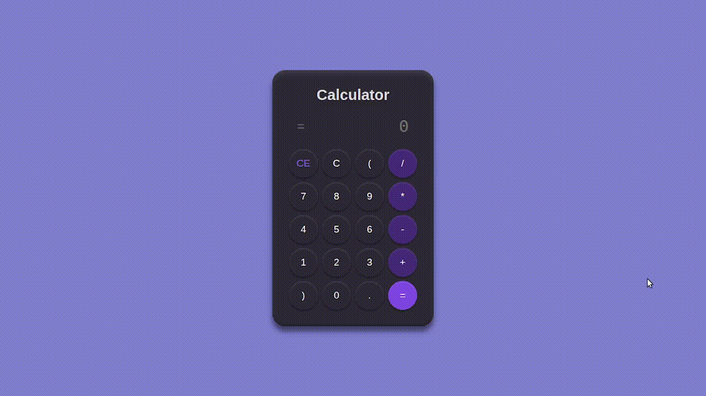

[](https://classroom.github.com/a/4qVHBKNB)

# Calculadora

Este repositório é dedicado a realização de Atividade da Disciplina DevOps 25.1 do Curso de Ciência da Computação da UFCG.

## 🚀 O Projeto

A calculadora é uma aplicação web simples, desenvolvida utilizando HTML5, CSS3 e JavaScript. Abaixo, um captura real da aplicação em funcionamento.



## ▶️ Como Rodar o Projeto

Para rodar o projeto clone este repositório e, a partir da raiz do projeto, ir em `/app` e abrir o arquivo `index.html` no navegador de sua preferência.

### 💻 Live Server (Visual Studio Code)

Alternativamente, caso esteja no [Visual Studio Code](https://code.visualstudio.com) pode usar a extensão [Live Server](https://marketplace.visualstudio.com/items?itemName=ritwickdey.LiveServer) para rodar o projeto.

Para isso, basta instalá-la na seção de extensões do VS Code e, em seguida, abrir o arquivo `/app/index.html` e, por fim, rodar das seguintes maneiras:

1. Clicar com o botão direito do mouse (ou touchpad em notebooks) e selecionar a opção **Open With Live Server**;
2. Utilizar o atalho padrão do Live Server (caso não tenha modificado): **Alt + L Alt + O**.

Com isso, o projeto será aberto automaticamente na url do tipo `http://127.0.0.1:5500/app/index.html`.

Analogamente, caso deseje encerrar a execução do projeto, basta:

1. Clicar com o botão direito do mouse (ou touchpad em notebooks) e selecionar a opção **Stop Live Server**;
2. Utilizar o atalho padrão do Live Server (caso não tenha modificado): **Alt + L Alt + C**.

## 🧪 Como Rodar os Testes do Sistema

Os testes do projeto foram desenvolvidos utilizando o framework JavaScript de testes automáticos [Cypress](https://www.cypress.io/).

Com isso, para que os testes funcionem corretamente é necessário que o projeto esteja em funcionamento em um servidor local (ou remoto), como mostrado anteriormente com o [Live Server](https://marketplace.visualstudio.com/items?itemName=ritwickdey.LiveServer).

Caso deseje utilizar outro servidor para rodar o projeto é importante alterar a URL de requisição do Cypress em `/cypress/e2e/calculator.cy.js` e, na função **BeforeEach()** alterar a URL em `cy.visit('http://127.0.0.1:5500/app/index.html')` para a url onde seu projeto local esta rodando.

### 📋 Pré-Requisitos

Para rodar os testes com **Cypress** é necessário:

-  Possuir o [Node.js](https://nodejs.org/) instalado em seu sistema. Atualmente (Julho de 2025), as versões suportadas são **18.x**, **20.x**, **22.x** e superiores. Recomenda-se utilizar a versão LTS.

Além disso, é importante verificar os requisitos do sistema operacional na [documentação do Cypress](https://docs.cypress.io/app/get-started/install-cypress).

### ⚙️ Rodando os Testes

Agora, com o repositório clonado, abra o seu terminal na raiz do projeto.

Em seguida, para rodar os testes, recomenda-se utilizar o gerenciador de dependências **npm** devido a sua simplicidade na instalação dessas. Caso deseje utilizar outro gerenciador de dependências (como **yarn** ou **pnpn**) basta consultar o [manual de instalação do Cypress](https://docs.cypress.io/app/get-started/install-cypress).

Assim, utilizando **npm**, para rodar os testes do sistema com Cypress é necessário instalar as dependências necessárias:

```
npm install
```

#### 🖥️ 1. Rodar Cypress em modo headless (terminal)

```
npx cypress run
```

Isso executará todos os testes e exibirá os resultados diretamente no terminal.

> 💡 Dica: se seu servidor local não estiver rodando, o Cypress não conseguirá acessar sua página para os testes.

#### 🖱️ 2. Abrir o Cypress em modo interativo

```
npx cypress open
```

Isso abrirá a interface do Cypress, onde você poderá escolher e rodar seus testes em modo gráfico.

Na interface:

1. Selecione a opção **E2E Testing**;
2. Escolha o navegador de sua preferência (Chrome, Electron ou Firefox) e clique no botão de iniciar os testes e2e no navegador selecionado;
3. Clique no arquivo `calculator.cy.js` para abrir os testes do arquivo.

O sistema irá, no lado esquerdo, rodar a lista de testes e, no lado direto, mostrar as capturas reais da aplicação sendo executada em cada teste.